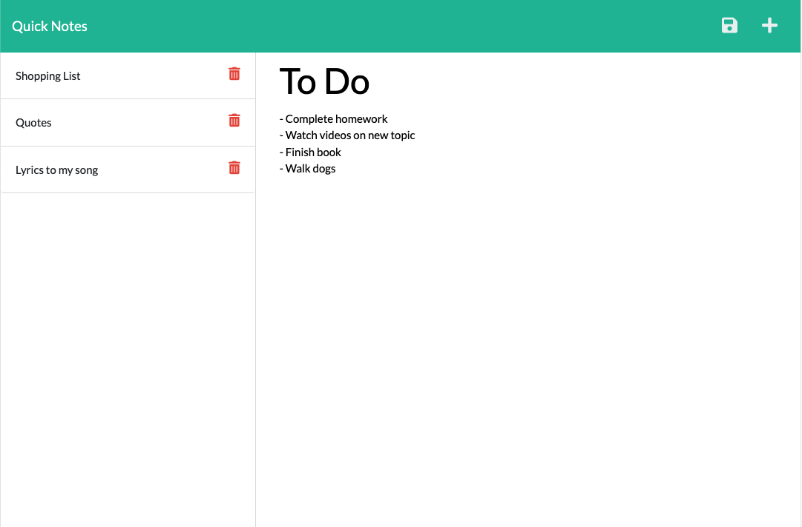

# Quick Notes

This application is a useful tool which is designed to create, edit and organise notes in a simple and user-friendly fashion. I was motivated by the idea of having a secure and quick notes taking page, which would help me organise anything I needed to remember. This has been a fantastic demonstration of the power of Express.js and I have throughly enjoyed the process to deliver this final result

## Table of Contents

1.  [Installation](#installation)
2.  [Usage](#usage)
3.  [License](#license)
3.  [Credits](#credits)
4.  [Questions](#questions)

## Installation 

Simply access the [Live Deployment](https://quick-notes-kf.herokuapp.com/) on Heroku and you're ready to start taking notes!

## Usage

To use Quick Notes, all you have to do is click 'Get started' and you'll instantly see a new note which you can begin writing in. You can use these notes for all sorts of things, including shopping lists, tasks you have to do, important bits of information you want to remember and so much more! Once you've finished typing your note, click the 'save' icon and your note will be stored on the left side of the screen. To access previous notes, click on their title to open. To delete notes, click the 'bin' icon. You're all set, enjoy Quick Notes!

## License
This project is created under the MIT license

## Credits
This project was created by [kieranmichaelflynn](https://github.com/kieranmichaelflynn)

## Questions
To see it yourself, visit my GitHub repository at https://github.com/kieranmichaelflynn/Quick-Notes.git

If you have any further questions, reach out to me at kieranmichaelflynn@gmail.com 

Thank you for reading, enjoy Quick Notes!
    
